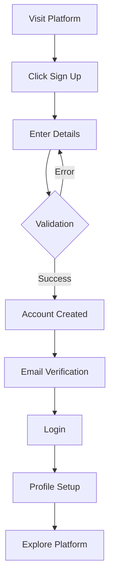
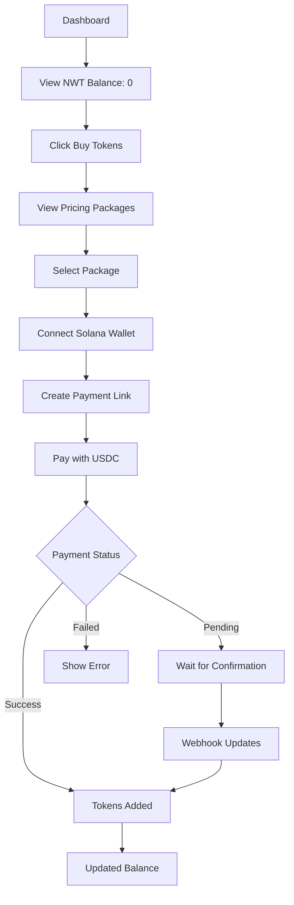
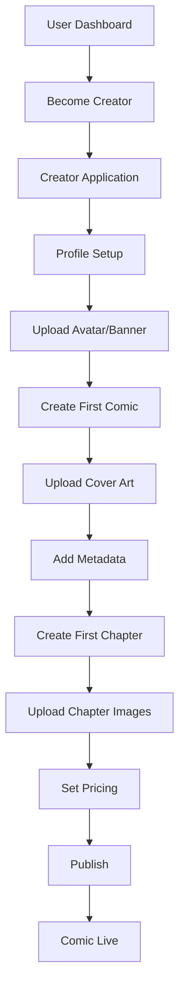
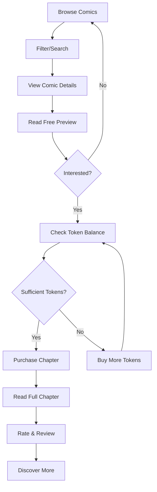
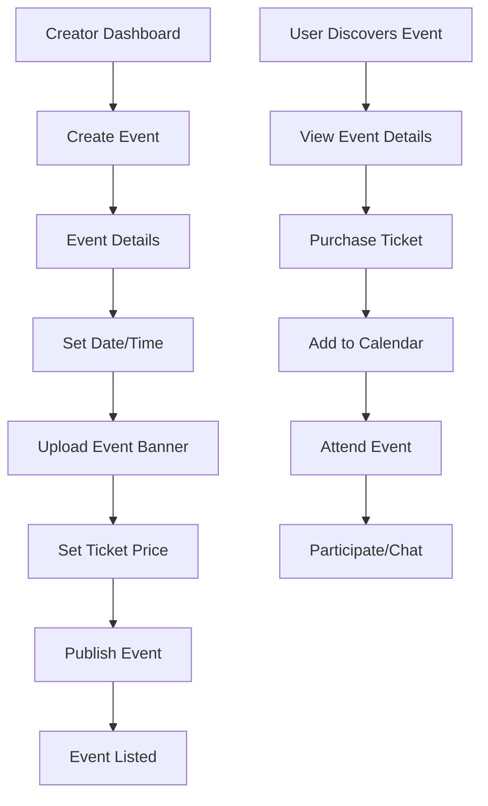
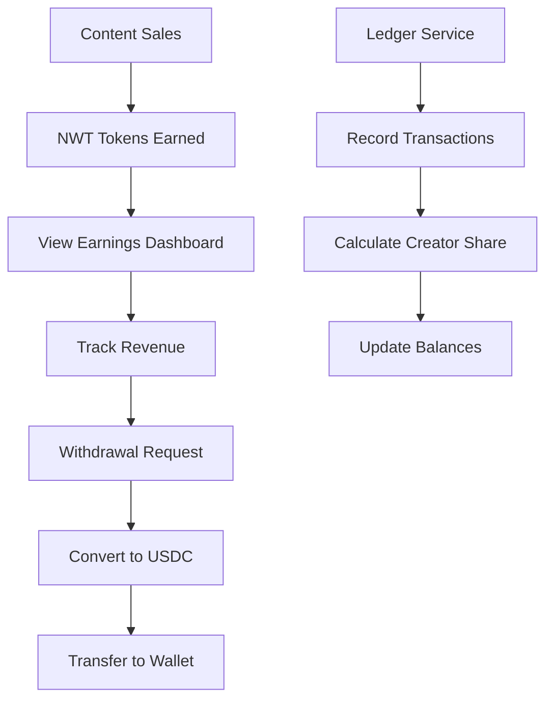
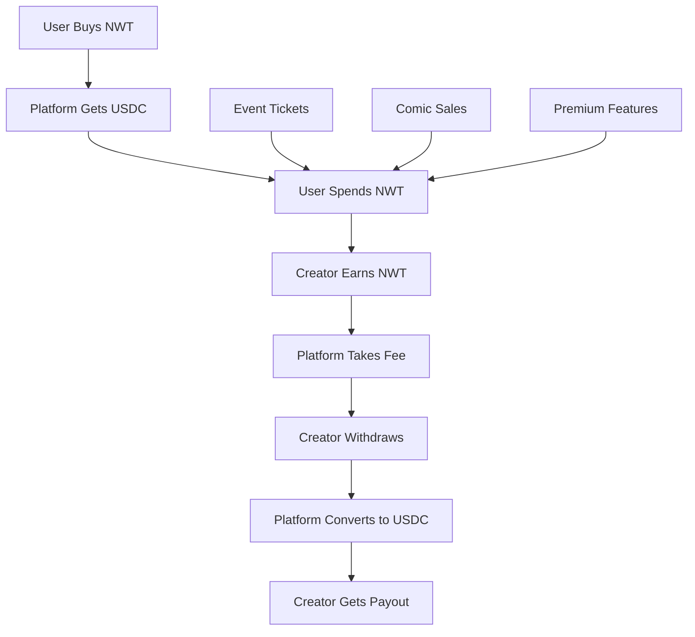

# 🔄 Complete User Flow Documentation

## 📋 Overview
This document outlines the complete user journeys through the Nerdwork+ platform, from registration to content creation and consumption.

## 🎭 User Personas

### 1. **Reader/Consumer**
- Discovers and reads comics
- Attends virtual events
- Purchases content with NWT tokens

### 2. **Creator**
- Creates and publishes comics
- Hosts virtual events  
- Earns revenue from content sales

### 3. **Event Organizer**
- Creates and manages events
- Sells tickets via NWT tokens
- Manages attendee experiences

---

## 🚀 Flow 1: New User Registration & Onboarding



### API Calls:
1. **POST** `/auth/signup`
2. **POST** `/auth/login`
3. **POST** `/users/profile`
4. **GET** `/users/me`

### Frontend Screens:
1. Landing Page
2. Registration Form
3. Email Verification
4. Profile Setup
5. Dashboard

---

## 💰 Flow 2: First-Time Token Purchase



### API Calls:
1. **GET** `/wallet/pricing`
2. **POST** `/wallet/connect`
3. **POST** `/wallet/payment-link`
4. **GET** `/wallet/payment/{id}/status`
5. **GET** `/wallet/`

### Web3 Integration:
- Solana wallet connection
- USDC payment via Helio
- Transaction confirmation

---

## 🎨 Flow 3: Creator Onboarding & First Comic



### API Calls:
1. **POST** `/users/creator/become`
2. **PUT** `/users/creator/profile`
3. **POST** `/files/upload` (images)
4. **POST** `/comics/` (create comic)
5. **POST** `/comics/{id}/chapters`
6. **PUT** `/comics/{id}/publish`

### File Uploads:
- Creator profile images
- Comic cover art
- Chapter page images
- Metadata and descriptions

---

## 📖 Flow 4: Reader Discovery & Purchase



### API Calls:
1. **GET** `/comics/` (browse)
2. **GET** `/comics/{id}` (details)
3. **GET** `/comics/{id}/chapters/{chapterId}/preview`
4. **POST** `/wallet/spend` (purchase)
5. **GET** `/comics/{id}/chapters/{chapterId}` (full content)
6. **POST** `/comics/{id}/reviews`

---

## 🎫 Flow 5: Event Creation & Attendance



### API Calls:
1. **POST** `/events/` (create)
2. **POST** `/files/upload` (banner)
3. **PUT** `/events/{id}/publish`
4. **GET** `/events/` (browse)
5. **POST** `/events/{id}/tickets/purchase`
6. **GET** `/events/{id}/attendees/me`

---


## 💸 Flow 6: Creator Revenue & Payout



### API Calls:
1. **GET** `/ledger/creator-earnings/{creatorId}`
2. **POST** `/wallet/withdraw-request`
3. **GET** `/ledger/transactions`
4. **POST** `/payments/payout`

---

## 🔄 Flow 7: Platform Economy Cycle



---

## 📱 Frontend Application Structure

### Core Pages:
1. **Authentication** (`/auth`)
   - Login/Register
   - Password Reset
   - Email Verification

2. **Dashboard** (`/dashboard`)
   - User Overview
   - Recent Activity
   - Quick Actions

3. **Comics** (`/comics`)
   - Browse/Search
   - Comic Details
   - Chapter Reader
   - Creator Tools

4. **Events** (`/events`)
   - Event Listing
   - Event Details  
   - Ticket Management
   - Live Event View

5. **Wallet** (`/wallet`)
   - Balance Overview
   - Transaction History
   - Buy Tokens
   - Connect Web3 Wallet

6. **Profile** (`/profile`)
   - User Settings
   - Creator Dashboard
   - Earnings Overview

### State Management:
- **User State**: Authentication, profile
- **Wallet State**: Balance, transactions
- **Content State**: Comics, events, purchases
- **UI State**: Loading, errors, notifications

### Web3 Integration:
```javascript
// Wallet connection example
const connectWallet = async () => {
  if (window.solana) {
    const response = await window.solana.connect();
    const walletAddress = response.publicKey.toString();
    
    // Connect to backend
    await fetch('/api/wallet/connect', {
      method: 'POST',
      headers: {
        'Authorization': `Bearer ${token}`,
        'Content-Type': 'application/json',
      },
      body: JSON.stringify({
        walletAddress,
        walletType: 'phantom'
      }),
    });
  }
};
```

---

## 🚨 Error Handling & Edge Cases

### Common Error Scenarios:
1. **Insufficient Balance**: Redirect to buy tokens
2. **Payment Failed**: Retry or contact support
3. **Content Not Available**: Show appropriate message
4. **Network Issues**: Offline mode/retry logic
5. **Authentication Expired**: Force re-login

### Retry Logic:
- Payment status polling
- File upload retries
- API call retries with exponential backoff

---

## 📊 Analytics & Tracking

### Key Metrics:
1. **User Engagement**
   - Registration conversion
   - Daily/Monthly active users
   - Content consumption

2. **Revenue Metrics** 
   - Token sales volume
   - Creator earnings
   - Platform fees collected

3. **Content Performance**
   - Comic views/purchases
   - Event attendance
   - Creator success rates

### Implementation:
```javascript
// Track user actions
const trackEvent = (eventName, properties) => {
  analytics.track(eventName, {
    userId: user.id,
    timestamp: new Date().toISOString(),
    ...properties
  });
};
```

---

## 🔧 Technical Considerations

### Performance:
- Image optimization and CDN
- Lazy loading for comics
- Caching strategies
- Database query optimization

### Security:
- JWT token management
- File upload validation
- Rate limiting
- CORS configuration

### Scalability:
- Microservices architecture
- Horizontal scaling with Lambda
- Database connection pooling
- CDN for static assets

---

**This comprehensive user flow documentation provides the blueprint for building a complete, user-friendly platform that seamlessly integrates Web3 payments with traditional user experiences.**